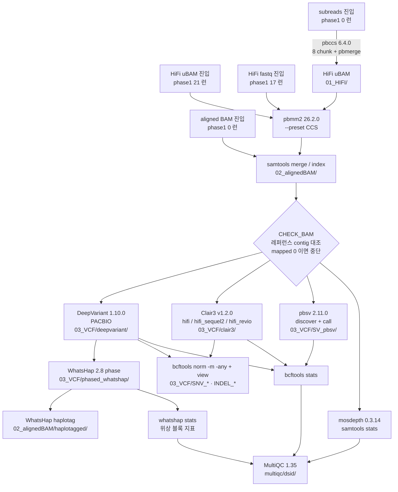

# Phase 1 — PacBio HiFi: raw → VCF

GIAB PacBio HiFi 전 데이터셋을 **각자의 가장 raw한 형태부터** 정렬·변이 호출한다
(fastq > HiFi uBAM > aligned BAM 순. GIAB이 만든 처리 산출물은 무시하되 지우지 않음 — 2026-08-21 정책).
파이프라인: pbmm2 → DeepVariant + Clair3 → WhatsHap phase/haplotag → pbsv → QC.
[pipeline/pacbio-hifi-wgs](pipeline/pacbio-hifi-wgs/)는 bioinfo-agent에서 vendoring ([차이](pipeline/VENDORED.md)).



ONT 쪽 같은 그림은 [phase2_ont/pipeline/ont-wgs/README.md](../phase2_ont/pipeline/ont-wgs/README.md).
차이는 정렬(pbmm2→minimap2), SV(pbsv→Sniffles2), 위상(WhatsHap→LongPhase), 그리고 R9.4.1에서 DeepVariant가 빠지는 것이다.

- 실행 단위: **49개** ([run_table.tsv](run_table.tsv)) = 카탈로그 HiFi 행을 (sample, dataset)로 분해
  (HG008 T/N 분리, HG009 passage·클론 11개 분리). 잡 1개 = 실행 단위 1개.
  2026-09-22 HG008-T NIST 9개(bulk p100 + 클론 8), 2026-09-24 HG008-T bulk p21·p41(UMD Revio)을 더했다 —
  둘 다 생성기 스펙 누락이었다.
- 진입점: fastq 17 / HiFi uBAM 21. **aligned BAM 진입은 없다** — HG001·HG005 SequelII 11kb도
  SRA에서 리드를 받아 fastq부터 돈다 (아래 SRA 항목).
- 이 중 4개는 `dup_of` 표시 — HG001·HG003·HG004·HG005의 chemistry2는 HudsonAlpha와 **movie가 동일**
  (형태만 fastq/uBAM). 기본 제출에서 빠진다. 다만 카탈로그상 별개 데이터셋이라 "전부 VCF까지" 정책을
  문자 그대로 채우려면 돌려야 하고, 실측 기준 4개(406 GiB) 동시 실행에 6~7시간이면 끝난다:
  `DUP_OK=1 scripts/10_submit.sh <dsid>` (돌리지 않으면 `50_update_catalog.py`가 그 4행을 계속 "대기"로 보고).
- 산출: `/BiO/scratch/ehojune/GIAB_benchmark/processed_data_ehojune/<sample>/PacBio/<dataset>/{02_alignedBAM,03_VCF,04_QC}`
- 입력 합계 3.13 TiB (중복 제외 2.73 TiB, 34 runs). 노드 3개 / 노드당 2잡 = 동시 6런.

**실측 (2026-08-21, 30슬롯 잡, 첫 4런 완주)**

| 실행 단위 | 커버리지 | 입력 | wallclock | maxvmem |
|---|---|---|---|---|
| HG001.HudsonAlpha_PacBio_CCS | (미기재) | 65.9 GiB | 5h50m | 53.8 GB |
| HG002.PacBio_CCS_10kb | 약 30x | 165.5 GiB | 5h58m | 48.4 GB |
| HG002.PacBio_CCS_15kb | 약 28x | 166.2 GiB | 7h17m | 45.1 GB |
| HG002.PacBio_SequelII_CCS_11kb | 약 32x | 78.4 GiB | 6h46m | 43.1 GB |

커버리지는 카탈로그 값. 넷 다 `exit_status 0`.

- **메모리는 준 110 GB의 절반도 안 썼다** (피크 43~54 GB). 30x 기준이므로 HG008(106~116x)·
  HG009(61~140x)도 한도 안에 들어올 가능성이 높다 — 현재 설정 그대로 두면 된다.
- 시간은 6~7h/런. 커버리지에 비례해 늘어나므로 고심도 런은 12~25h 대로 예상,
  전체 32런 종료까지 **2~4일** 규모 (동시 6런).

## 실행 (nbb2 로그인 노드)

```bash
cd ~/GIAB_benchmarking && git pull    # 서버의 클론 위치 기준
cp phase1_pacbio_hifi/env.local.sh{.example,}              # 잡 크기 프리셋 선택 (안 하면 노드당 3잡 기본값)
bash phase1_pacbio_hifi/scripts/01_prepare_login_node.sh   # 1회: SGE 점검 + 컨테이너 13개(파이프라인 11 + 벤치 2) + 레퍼런스 + TRF bed
bash phase1_pacbio_hifi/scripts/02_fetch_sra_reads.sh      # 1회: HG001·HG005 리드 (SRA, 135 GiB)
bash phase1_pacbio_hifi/scripts/10_submit.sh --ready       # 준비된 것 전부 제출 (dup 제외; --list로 미리보기)
bash phase1_pacbio_hifi/scripts/20_status.sh               # 진행 대시보드 (입력/잡 상태/단계별 산출물)
bash phase1_pacbio_hifi/scripts/30_verify_outputs.sh       # 산출물 존재 검증 (dsid 인자 주면 그것만)
python phase1_pacbio_hifi/scripts/35_review_qc.py          # QC 지표 리뷰 (이상치 표시; --tsv 로 요약 저장)
bash phase1_pacbio_hifi/scripts/36_multiqc_all.sh          # 전 런을 MultiQC 리포트 하나로 병합
python phase1_pacbio_hifi/scripts/50_update_catalog.py     # 완료분 → 카탈로그+README 표 반영, git diff 보고 커밋
bash phase1_pacbio_hifi/scripts/60_benchmark.sh --list     # 정확도 평가 대상 확인 (truth set 유무)
bash phase1_pacbio_hifi/scripts/60_benchmark.sh --ready    # hap.py 제출 (HG001~HG007)
bash phase1_pacbio_hifi/scripts/60_benchmark.sh --collect  # 결과를 한 TSV로 모음
STRAT=1 bash phase1_pacbio_hifi/scripts/60_benchmark.sh --ready    # 구간별(층화) hap.py
bash phase1_pacbio_hifi/scripts/62_tstv_regions.sh         # ts/tv 를 benchmark 구간 안/밖으로 갈라 셈
bash phase1_pacbio_hifi/scripts/qsub_task.sh <이름> -- <명령>  # 위 로그인 노드용 점검을 SGE 잡으로 (전 런이면 한두 시간)
```

- 특정 것만: `10_submit.sh HG002.PacBio_CCS_15kb ...` / 로그: `tail -f $INFRA/logs/<dsid>.<jobid>.log`
- 잡이 죽으면 **같은 dsid로 재제출하면 -resume** 으로 이어서 돈다 (완료분 재계산 없음).
- 끝난 run의 중간 파일 정리: `scripts/40_clean_work.sh <dsid>` (verify 통과분만 지움).
- **30은 파일이 있는지만 본다.** 커버리지가 반토막이거나 변이 수가 두 배거나 위상이 거의 안 잡힌
  런도 통과한다. `35_review_qc.py`가 그 틈을 메운다 — 파이프라인이 이미 만든 QC 파일
  (mosdepth·samtools stats·bcftools stats·whatshap stats·MultiQC)만 읽어서 실행 단위별로
  커버리지·매핑률·error rate·리드길이·SNP/INDEL 수·ts/tv·SV 수·위상 비율·block N50을 표로 뽑고,
  기준을 벗어난 것과 **DeepVariant↔Clair3 불일치(20% 이상)** 를 표시한다. 새로 계산하지 않아 몇 초면 끝난다.
  기준값은 스크립트 맨 위 `TH` dict에서 조정한다. 종양(HG008-T·HG009T-*)은 LOH·배수성 때문에
  변이 수 검사에서 면제하고 위상 하한도 따로 쓴다 (정상 70% / 종양 55%).
  **변이 수·ts/tv·caller 일치는 `--pass-counts`를 붙일 때만 판정한다** — 파이프라인의
  `bcftools stats`가 PASS 필터 없이 돌아 RefCall이 섞인 raw 카운트라서, 그대로 판정하면 전건 오탐이 난다.
  exit 1은 QC 파일 자체가 없을 때만이고(파이프라인 QC 스테이지 실패), 기준 초과는 경고로만 남긴다.
  `50_update_catalog.py`의 완료 판정도 30과 같은 파일 목록이라 QC 내용은 보지 않는다 — 35를 별도로 돌릴 것.
- **다운로드가 진행 중이어도 그냥 제출하면 된다.** `--ready`는 입력이 (1) manifest와 크기가 같고
  (2) 최근 10분간 쓰이지 않은 실행 단위만 집는다. 나중에 다시 돌리면 새로 준비된 것이 제출된다
  (완료/실행 중인 것은 자동 스킵). 대기 시간은 `READY_AGE_MIN=N`으로 조정.
  - mtime까지 보는 이유: phase0의 기본 경로 `aws s3 cp`는 `.part` 없이 최종 파일명에 바로 쓰고
    대용량은 멀티파트로 오프셋에 나눠 쓴다. 뒤쪽 파트가 먼저 도착하면 **크기는 최종값인데
    중간이 빈 구멍인** 순간이 생겨서, 크기만 보면 완료로 오판한다. (wget 경로는 `.part`→`mv`라 무관)
  - `20_status.sh`의 input 열에서 `settling`이 그 상태다. 다운로드가 끝난 뒤에도 계속 `settling`이면
    그 파일을 실제로 쓰는 중이 아닌지(`ls -l --time-style=full-iso`) 확인할 것.

## 정확도 평가 ([60_benchmark.sh](scripts/60_benchmark.sh))

GIAB truth set 대비 hap.py. germline small variant만 — **HG001~HG007 19런**이 대상이고
HG008·HG009는 germline truth가 없어 자동으로 빠진다.

**2026-09-22 전량 완료** (19런 × 2 caller = 38건, 전부 exit 0). 결과와 판정은
[중간 보고](../docs/reports/2026-09-22-phase1-pacbio-benchmark.md), 수치는
[실측 기록](../docs/reference/2026-09-22-pacbio-hifi-benchmark-first-results.md).

- 입력은 `03_VCF/<caller>/*.vcf.gz` **원본**이다. hap.py가 FILTER를 자체 처리해
  `summary.csv`에 ALL 행과 PASS 행을 둘 다 내므로, PASS 필터가 없는 파이프라인 산출물을
  그대로 넣고 PASS 행을 읽으면 된다. **재실행이 필요 없다.**
  `SNV_*`/`INDEL_*` 분리본은 넣지 않는다 — hap.py 자체 분류와 어긋난다.
- truth set은 `release/*/NISTv4.2.1/GRCh38/`에서 자동 탐색한다. 경로 깊이와 BED 이름이
  샘플마다 다르다: HG001은 `release/NA12878_HG001/`, HG002~HG007은 `release/<Trio>/<Sample>/`,
  Ashkenazim 트리오(HG002~HG004)의 BED은 `_benchmark_noinconsistent.bed`다.
  truth VCF의 `.tbi`가 없으면 제출 단계에서 걸러낸다.
- 산출: `<dataset>/05_BENCH/happy/<id>.<caller>.summary.csv` 등. `--collect`가 이를 모아
  `phase1_bench_summary.tsv`(dsid × caller × SNP/INDEL × ALL/PASS)로 만든다. 출력은 이 디렉토리 밑이다.
- 잡 크기는 파이프라인보다 작다 (`BENCH_SLOTS=16`, `BENCH_VMEM=56G`). 실측 maxvmem
  48.4~48.8 GB / wall 56~83분 — 16슬롯이면 64코어 노드에 동시 4잡 = 194/251 GB 다.
- 컨테이너는 `env.sh`의 `HAPPY_IMG`(`jmcdani20/hap.py:v0.3.12`, GIAB/NIST 문서가 쓰는 이미지)와
  `TRUVARI_IMG`. `nextflow.config`가 아니라 `env.sh`에 둔 이유는 파이프라인이 쓰지 않기 때문이고,
  `01_prepare_login_node.sh`가 `BENCH_IMAGES`도 함께 미리 받는다.

### 구간별 평가 (`STRAT=1`)

위 점수는 benchmark BED 전체 한 덩어리다. Sequel I 의 INDEL 격차가 호모폴리머 탓인지,
Revio 에서 Clair3 가 DeepVariant 에 지는 곳이 어디인지는 이것으로 안 보인다.
`STRAT=1` 은 GIAB genome-stratifications(`BENCH_STRAT_VER`, 기본 v3.6)에서 고른 25개 구간을
`hap.py --stratification` 으로 함께 센다.

- 산출은 `05_BENCH/happy_strat/` 에 따로 둔다. 기본 결과를 덮지 않는다.
- `--collect` 가 `extended.csv` 를 모아 `phase1_bench_strat_summary.tsv` 로 만들고, `Subset=*` 행이
  기본 실행 `summary.csv` 와 TP·FN·FP 까지 같은지 대조한다. 다르면 두 실행의 입력이 어긋난 것이다.
- 구간 목록은 `env.sh` 의 `BENCH_STRAT_SET`. GIAB 목록 188개 중 절반은 샘플별 GenomeSpecific 이라
  질문에 맞춰 골랐다(호모폴리머 길이, 반복·저매핑·segdup, 쉬운 영역, 코딩 영역). 전부는 `=all`.
- 잡 크기(`BENCH_STRAT_THREADS=16` / `BENCH_STRAT_SLOTS=32`)는 **실측 전 값**이다. 슬롯은 노드당
  동시 2잡으로 묶는 용도이고 hap.py 는 16스레드로 돈다.

## SV 정확도 평가 ([61_benchmark_sv.sh](scripts/61_benchmark_sv.sh))

GIAB HG002 v5.0q stvar 대비 Truvari 5.4.0. **2026-09-22 완료** — HG002 5런, refine 후
F1 .8208~.8418, 전부 exit 0.

- **대상이 HG002 다섯 런뿐인 이유**: GRCh38 germline SV truth 를 가진 GIAB 샘플이 HG002 하나다.
  널리 인용되는 `HG002_SVs_Tier1_v0.6` 은 **GRCh37 전용**이라 우리 GRCh38 결과에 못 쓴다.
- 파라미터는 GIAB v5.0q README 가 지정한 명령 그대로 (`--pick ac --passonly -r 2000 -C 5000` + refine).
  `-C 5000` 은 chunksize지 sizemin 이 아니다.
- truth 는 `ALT="*"` 를 미리 걸러 `$INFRA/reference/sv_truth/` 에 캐시한다(README 지시). phase2 와 공유.
- `--collect` 가 refine **전·후**를 둘 다 낸다. refine 이득이 +.049~.054 로 phase2 ONT(+.048~.051)와
  거의 같다 — 콜 품질이 아니라 표현 정규화라는 설명과 맞는다.
- 잡 크기: `BENCH_SV_SLOTS=33`(노드당 1잡), `BENCH_SV_THREADS=8`, `BENCH_SV_TIMEOUT=4h`.
  **`-t` 를 NSLOTS 에 묶지 않는다** — abPOA 메모리가 스레드에 딸려 올라가 슬롯으로 동시 실행 수를
  줄이려는 시도가 무력해진다(2026-09-22 에 이것 때문에 ENOMEM 으로 두 번 죽었다).

## somatic (HG008-T) — 미착수

정답셋은 받아 뒀다 (smvar V0.3-2026-04-25, stvar-CNV V0.5-2026-03-18).
막힌 것은 데이터가 아니라 **설계**다 — 우리 파이프라인이 내는 것은 germline caller 의 전체 변이
(germline + somatic)인데 GIAB somatic 벤치마크는 종양 특이 변이만 담는다. 그대로 대면 germline 이
전부 FP 가 된다. somatic caller 가 필요하고, 매칭 정상도 NIST 트리에 없어 Liss_lab 것을 써야 한다
(랩 차이가 섞인다). 선택지와 쟁점은 [docs/STATUS.md](../docs/STATUS.md) #9.
기준 근거는 [docs/reference/2026-08-26-hg008-benchmark-refresh.md](../docs/reference/2026-08-26-hg008-benchmark-refresh.md).

## 설정 (전부 [env.sh](env.sh))

| 항목 | 기본값 | 비고 |
|---|---|---|
| 큐/노드 | `$SGE_QUEUE` x `$SGE_HOSTS` (env.sh) | **노드 집합은 고정이 아니다** — 2026-09-22 기준 octopus-2-8/2-9 + shepherd-1-8/1-9 네 대, 큐 둘. 계산 노드는 외부망 없음 → `NXF_OFFLINE`, 사전 캐시 |
| 잡 크기 | 21슬롯 / h_vmem 78G / Nextflow 70G = **노드당 3잡** | 노드는 64코어·251 GB. `h_vmem`은 consumable=NO라 **메모리가 예약되지 않는다** — 노드당 잡 수를 통제하는 건 슬롯뿐이므로 (노드당 잡 수)×`NF_LOCAL_MEM_GB` < 251을 지켜야 한다. 프리셋은 [env.local.sh.example](env.local.sh.example) |
| Nextflow | 24.10.5 + conda `nfcore312` (JDK17) | 잡 안에서 local executor로 완주 (SGE 자식 잡 없음) |
| 레퍼런스 | GRCh38_no_alt_analysis_set (release에서 복사) | 산출 파일명 라벨 `REF_NAME=GRCh38` |

- clair3 모델은 run_table의 값(m54→`hifi`, m64→`hifi_sequel2`, m84→`hifi_revio`)이 자동 적용된다.
- 샘플시트 재생성(경로 바꿀 때만): `python scripts/make_samplesheets.py --data-root <GIAB 루트>`
- gVCF가 필요해지면 `GVCF=1 FORCE=1 10_submit.sh <dsid>` 재제출 (-resume이라 DeepVariant만 다시 돈다).

## SRA 리드 (HG001·HG005 SequelII 11kb)

이 두 데이터셋만 GIAB FTP에 리드가 없다. GIAB는 정렬된 BAM만 올렸고 리드는 SRA에 있다
(HG001 PRJNA540705 / HG005 PRJNA540706). raw부터 돌리는 정책이라 SRA에서 직접 받는다.

- 대상: 샘플당 6 cell (11kb 4 + 9kb 2), 합계 **135 GiB**. 목록·크기·md5는 [sra_manifest.tsv](sra_manifest.tsv)
  (ENA filereport에서 생성). ENA HTTPS + `wget -c`라 중단 후 재실행하면 이어받는다.
- 저장 위치는 GIAB 미러와 섞이지 않게 `$GIAB_ROOT/sra/<PRJNA>/<sample>/<movie>.fastq.gz`.
  SRR 대신 movie ID로 저장하는 이유는 파일명이 파이프라인의 unit(=RG ID)이 되기 때문이다.
- **ENA 파일명이 `_subreads.fastq.gz`지만 CCS 리드다**: library_name이 `HG001-CCS-11kb-m64011...`이고
  cell당 1.3~1.8M reads / 평균 ~10 kb로 Sequel II HiFi 수율이다(진짜 subreads면 같은 cell에서
  리드가 수천만 개여야 한다). **ENA는 리드 이름을 `@SRR9001770.1`로 바꿔 배포하므로 이름으로는
  판정할 수 없다** — 다운로드 스크립트가 앞부분을 샘플링해 평균 리드 길이를 manifest 값과 대조한다.
  여기서 걸리면 그냥 쓰지 말 것: 진짜 subreads면 진입 타입을 `subreads`로 바꿔 CCS 단계를 태워야 한다.
- GIAB의 정렬 BAM으로 되돌리려면 `make_samplesheets.py`의 해당 RUNS 항목을 `aligned_bam`으로 바꾸면 된다
  (git 이력에 이전 정의가 있다).
